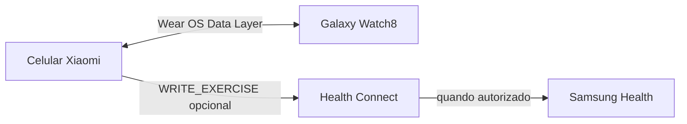

# Treino da Luana

Aplicativo pessoal de musculação com uma versão Android para o celular Xiaomi e uma versão Wear OS para o Samsung Galaxy Watch8.

A V16 foi desenhada para o uso real na academia: consultar o treino, trocar de dupla quando um aparelho estiver ocupado, registrar cada série no relógio e continuar depois sem perder o progresso.

## Interface V16

A V16 altera somente a interface do Galaxy Watch8. As fotografias originais, os quatro treinos, exercícios, séries, repetições, cargas, progresso e sincronização foram copiados da V15 sem mudanças.

Na tela de exercício, a fotografia ocupa a maior área útil. O nome e os checks das séries aparecem logo abaixo. Os comandos `‹` e `›` são circulares, permanecem fixos no arco inferior e não dependem da rolagem do conteúdo.

## O que mudou na V16

### Navegação orgânica

O botão **Duplas** permanece no topo. A lista é rolável e mostra cada dupla em um cartão maior, com fotografia, nome do movimento e número de séries concluídas. É possível abrir qualquer dupla em qualquer ordem.

Os botões circulares `‹` e `›` percorrem todos os exercícios do treino e permanecem inteiramente dentro da área segura da tela redonda. O botão físico inferior do Watch8 também volta para a tela anterior.

### Registro de séries

Cada série é marcada tocando nos números `1`, `2` e `3`. Um segundo toque desmarca a série. O progresso parcial é salvo imediatamente e sincronizado com o celular.

O exercício só é considerado concluído quando a pessoa toca em **Concluir exercício**, mesmo que ainda existam séries desmarcadas. A dupla é concluída somente quando seus dois exercícios forem concluídos explicitamente.

### Exercícios e fotografias

A fotografia original continua incorporada aos dois APKs e aparece maior no relógio. O enquadramento usa preenchimento do quadro, aceitando apenas um pequeno corte para aproveitar a tela circular.

A carga é cadastrada ou alterada somente no celular. No relógio ela aparece para consulta e é atualizada ao abrir o treino.

### Finalização

O treino pode ser finalizado mesmo com exercícios pendentes. A tela final apresenta:

* tempo total calculado silenciosamente
* quantidade real de exercícios concluídos
* botão para solicitar a sincronização com o Samsung Health
* retorno automático à tela inicial após 10 segundos

Não existe cronômetro de descanso automático na V16.

## Aplicativos para teste

| Arquivo | Finalidade |
| --- | --- |
| Pacote V16 | Será publicado depois da assinatura com a mesma chave privada usada na V15 |
| [Último pacote instalável: V15](releases/v15/Treino-da-Luana-v15-TESTE-COMPLETO.zip) | Xiaomi e instalador Windows do Watch8 |

O código da V16 usa `versionCode 17` e preserva o pacote `com.luanarabelo.treinodaluana.v12.xiaomitest`. Para funcionar como atualização sem remover o aplicativo anterior, o APK final precisa ser assinado com a mesma chave privada usada na V15.

> A chave privada de assinatura não faz parte do repositório. Os APKs publicados são builds de teste, não uma distribuição de loja.

## Instalação

### Xiaomi

1. Baixe o APK do Xiaomi.
2. Abra o arquivo no celular.
3. Confirme a atualização do aplicativo existente.

### Galaxy Watch8 no Windows

1. Baixe e extraia completamente o ZIP do instalador.
2. Se **Opções do desenvolvedor** não aparecer, abra **Configurações > Sobre o relógio > Informações do software** ou **Versões** e toque sete vezes em **Número da versão / Build number**.
3. Abra **Configurações > Opções do desenvolvedor** e ative **Depuração ADB** e **Depuração sem fio**.
4. Na tela de **Depuração sem fio**, anote o IP e a porta de conexão.
5. Entre em **Emparelhar novo dispositivo** e anote o código, o IP e a porta de emparelhamento.
6. Abra `INSTALAR-NO-WATCH8.bat` e informe os dados quando solicitado.
7. Depois da instalação, desative novamente as opções de depuração.

O relógio e o computador precisam estar na mesma rede Wi-Fi. A porta de conexão e a porta de emparelhamento são diferentes.

O script valida o SHA-256 do APK antes de instalar e usa `adb install -r`, preservando os dados da versão anterior quando a assinatura é compatível.

## Sincronização



| Dado | Origem principal | Direção |
| --- | --- | --- |
| Carga por exercício | Celular | Celular → relógio |
| Séries marcadas | Celular ou relógio | Bidirecional |
| Exercício concluído | Relógio | Relógio → celular |
| Progresso do bloco | Celular ou relógio | Bidirecional |
| Resumo final | Relógio | Relógio → celular → Health Connect |

A sincronização utiliza caminhos versionados do Data Layer para séries e resumo. A correção de compatibilidade do `DataItemBuffer`, introduzida na V14.1, foi preservada para evitar o fechamento do aplicativo no Xiaomi.

## Health Connect e Samsung Health

A autorização é opcional. Se ela não for concedida, o treino funciona normalmente e o aplicativo avisa no final que não foi possível registrar a sessão.

O aplicativo solicita apenas a permissão de escrita de exercício. Ele não lê dados de saúde e não possui backend próprio para coletar informações.

O botão apresentado no relógio envia a solicitação ao celular. O registro no Samsung Health depende do Health Connect instalado, da permissão de treino concedida e da integração do Samsung Health autorizada pelo usuário.

## Arquitetura

```text
treino-da-luana/v16/
├── app/                 aplicativo Android do Xiaomi
├── wear/                aplicativo Wear OS do Galaxy Watch8
├── installer-watch8/    BAT, PowerShell e instruções
├── docs/mockups/         cinco interfaces aprovadas em PNG e SVG
└── docs/tools/           gerador dos mockups

releases/v16/             criado somente após assinatura e empacotamento
```

Os dois módulos compartilham o mesmo domínio de treino em `WorkoutData`. O celular usa `PhoneProgressSync` e o relógio usa `WatchProgressSync` para trocar cargas, séries, conclusão e resumo pelo Wear OS Data Layer.

## Compilação

Requisitos:

* Java 17
* Android SDK 36
* Android Build Tools 35.0.0
* Gradle 8.11.1

```bash
cd treino-da-luana/v16
gradle :app:assembleDebug :wear:assembleDebug --no-daemon
```

Saídas esperadas:

```text
app/build/outputs/apk/debug/app-debug.apk
wear/build/outputs/apk/debug/wear-debug.apk
```

O fluxo [build-treino-da-luana-v16.yml](.github/workflows/build-treino-da-luana-v16.yml) executa a mesma validação no GitHub Actions.

## Integridade dos pacotes publicados

O arquivo `releases/v16/SHA256SUMS.txt` será criado junto com os APKs assinados. O instalador da V16 permanece bloqueado até receber o hash do APK final.

## Histórico

| Versão | Marco |
| --- | --- |
| V5 a V9 | Estrutura funcional e entrada das fotografias |
| V10 | Visual Premium Obsidian e progresso semanal |
| V11 | Experimentos de conectividade |
| V12 | Quatro treinos conjugados, Health Connect e aplicativo Watch8 |
| V13 | Sincronização de progresso entre Xiaomi e Watch8 |
| V14.1 | Interface do relógio, cargas e correção do crash `DataItemBuffer` |
| V15 | Duplas livres, rolagem real e séries interativas |
| V16 | Foto em destaque e navegação fixa para a tela circular |

## Limitações conhecidas

* O botão superior Home ou Power do relógio pertence ao sistema e não pode ser remapeado pelo aplicativo.
* O Samsung Health não recebe o treino diretamente do relógio. A solicitação passa pelo celular e pelo Health Connect.
* A sincronização depende de celular e relógio pareados e do Google Play Services disponível nos dois aparelhos.
* Esta versão foi validada por compilação, assinatura e análise estática. O teste final de ergonomia depende do uso no Galaxy Watch8 físico.

## Privacidade

O progresso é armazenado localmente. Não existe conta, servidor próprio, publicidade ou rastreamento. A integração de saúde é opcional e limitada ao registro de uma sessão de exercício concluída.
